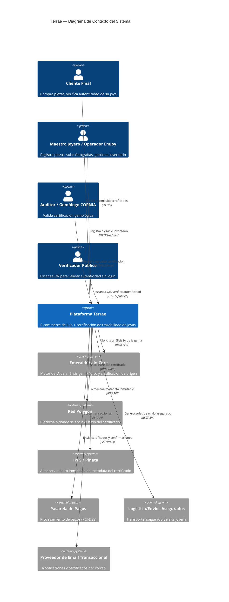
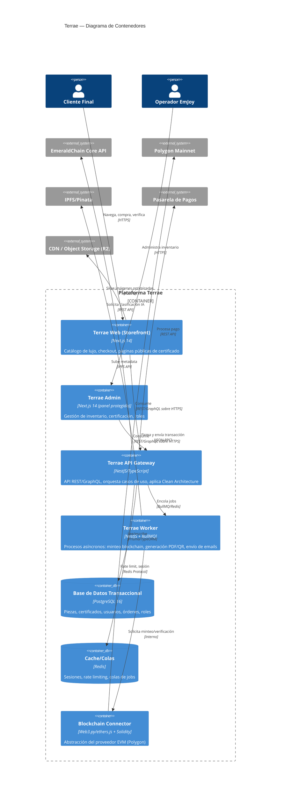
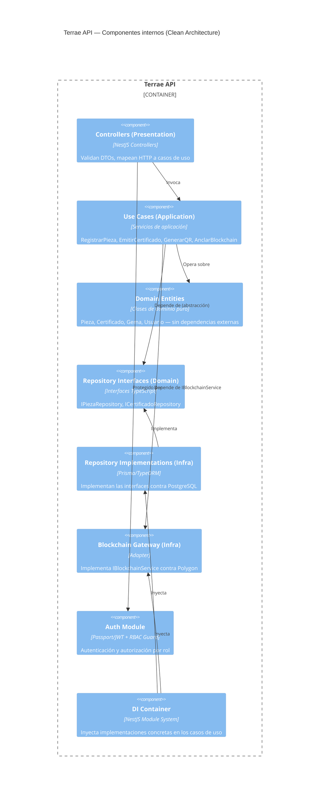
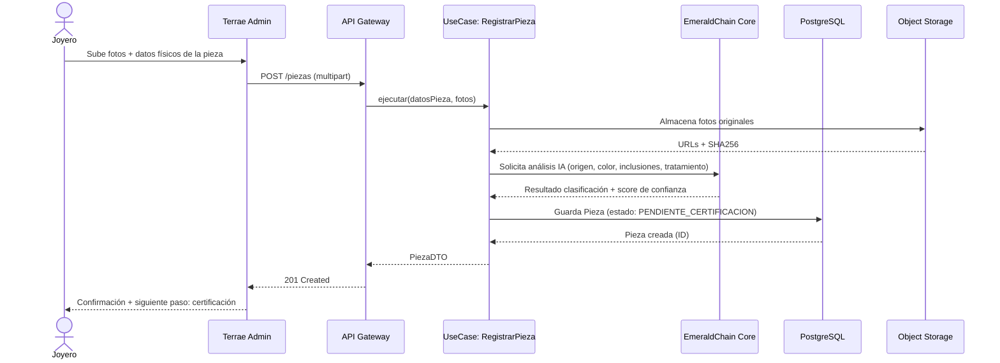
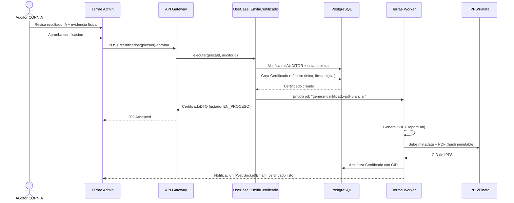
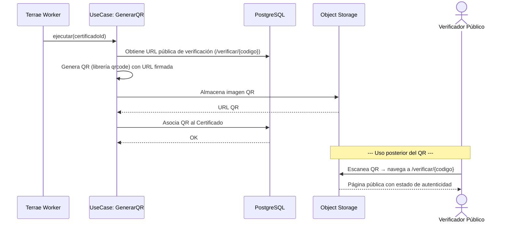
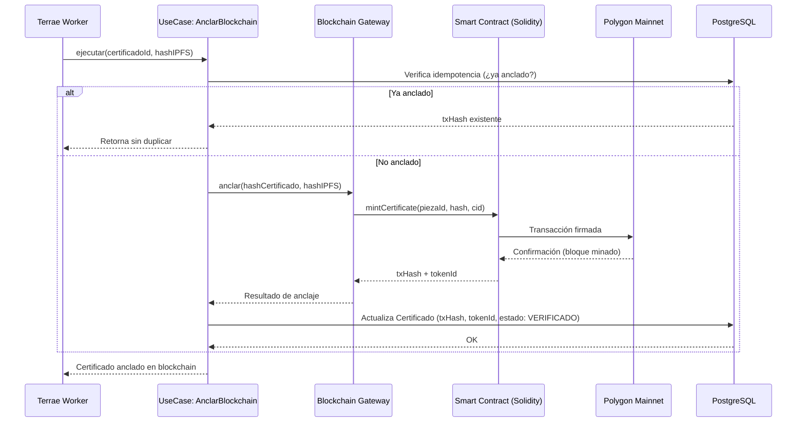
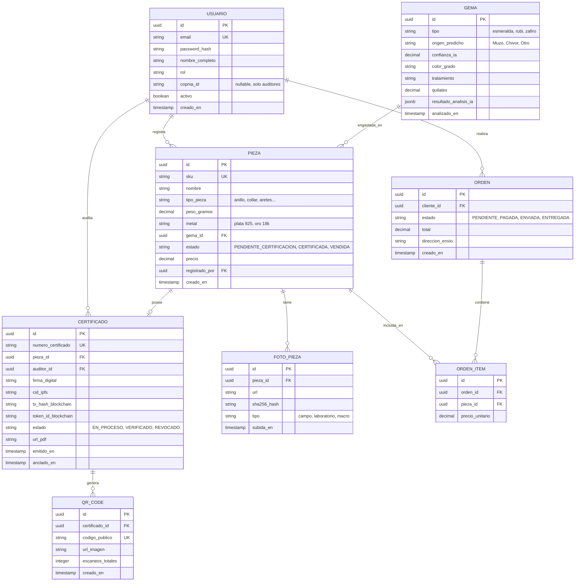

# TERRAE — Fase 0: Diseño y Arquitectura de Sistema
### *"Lo que la tierra esconde, Terrae lo revela"*

**Documento preparado por el equipo multidisciplinario Terrae:**
CTO · Arquitecto de Software Enterprise · Ingeniero Full Stack Senior · Diseñador UX/UI de Lujo · Especialista Blockchain · Ingeniero DevOps · Ingeniero en Ciberseguridad · CEO

**Fecha:** Julio 2026 · **Versión:** 1.0 · **Clasificación:** Confidencial — Uso interno EmJoy SAS

---

## 0.1 Resumen Ejecutivo

Terrae es la marca de alta joyería del ecosistema EmeraldChain (bajo EmJoy SAS), enfocada en esmeraldas y plata en el segmento de lujo accesible, con fuerte identidad cultural colombiana. Este documento constituye la **Fase 0** obligatoria antes de cualquier línea de código: arquitectura de sistema, diagramas C4, diagramas de secuencia, modelo de datos, estructura de API, modelo de permisos, convenciones de código y roadmap técnico.

**Principio rector de diseño:** *Lujo Silencioso (Quiet Luxury)*. La plataforma digital de Terrae debe sentirse como una boutique atendida por un maestro joyero, no como una tienda online genérica ni como un producto "tech". Cada pixel, transición y espacio en blanco comunica artesanía, herencia y exclusividad — nunca frialdad minimalista ni estética de startup.

---

## 0.2 Paleta de Colores — Extraída del Logotipo Terrae

La paleta fue extraída directamente de los 4 logotipos oficiales suministrados (versión fondo negro, fondo blanco, línea negra, línea dorada). Se documentan los valores HEX de producción con sus roles semánticos y variables de diseño (design tokens).

| Rol | Nombre | HEX | RGB | Uso |
|---|---|---|---|---|
| Primario | **Verde Terrae** | `#0E3B2E` | 14, 59, 46 | Fondos de marca, headers, botones primarios, iconografía estructural |
| Secundario | **Oro Satinado** | `#B8935A` | 184, 147, 90 | Tipografía de marca, bordes, acentos, hover states, líneas divisorias |
| Fondo | **Nogal** | `#1A1410` | 26, 20, 16 | Fondo base de la interfaz (modo lujo/noche), profundidad de superficies |
| Texto | **Marfil** | `#F3EDE0` | 243, 237, 224 | Texto principal sobre fondo Nogal, tarjetas, certificados |
| Resaltado | **Esmeralda** | `#0F9D63` | 15, 157, 99 | CTAs críticos, estados de éxito, sello de autenticidad, badge blockchain verificado |

**Tokens derivados (uso funcional, no decorativo):**

```css
:root {
  /* Marca — núcleo */
  --terrae-verde-950: #0E3B2E;
  --terrae-verde-800: #164F3D;
  --terrae-oro-500:   #B8935A;
  --terrae-oro-300:   #D4B685;
  --terrae-nogal-950: #1A1410;
  --terrae-nogal-900: #241C16;
  --terrae-marfil-100:#F3EDE0;
  --terrae-marfil-050:#FAF7F0;
  --terrae-esmeralda-500: #0F9D63;
  --terrae-esmeralda-300: #3DBE85;

  /* Estados funcionales (nunca colores "tech" tipo azul/rojo puro) */
  --estado-exito:     var(--terrae-esmeralda-500);
  --estado-alerta:    #B8763A; /* ámbar tierra, no amarillo semáforo */
  --estado-error:     #7A2E2E; /* rojo óxido, no rojo saturado */
  --estado-info:      var(--terrae-oro-500);

  /* Superficies con profundidad artesanal (nunca sombras genéricas Material) */
  --sombra-suave: 0 4px 24px rgba(14, 59, 46, 0.18);
  --sombra-relieve-oro: inset 0 1px 0 rgba(212, 182, 133, 0.15);
}
```

**Regla de gobierno de marca:** ningún azul, rojo saturado, morado o gris frío entra al sistema de diseño. Toda variación cromática debe derivarse por tinte/sombra de estos 5 colores base — nunca introducir colores externos a la paleta extraída del logotipo.

---

## 0.3 Tipografía Oficial (única, sin excepciones)

| Familia | Uso | Pesos |
|---|---|---|
| **Cormorant Garamond** | Titulares, nombres de piezas, certificados, momentos "hero" | 300 (Light), 500 (Medium), 600 (SemiBold) — itálica para citas/storytelling |
| **Jost** | UI funcional: navegación, botones, formularios, cuerpo de texto de producto | 300, 400, 500 |
| **JetBrains Mono** | Datos técnicos: hash SHA256, IDs de certificado, direcciones blockchain, códigos QR, timestamps | 400, 500 |

**Regla estricta:** ninguna otra tipografía (ni del sistema operativo, ni de librerías por defecto como Arial/Roboto/Inter) puede aparecer en ninguna superficie de la plataforma, incluidos correos transaccionales, PDFs de certificado y páginas de error 404.

```css
--font-display: 'Cormorant Garamond', serif;
--font-ui: 'Jost', sans-serif;
--font-mono: 'JetBrains Mono', monospace;
```

---

## 0.4 Dirección de Moodboard — "Lujo Silencioso"

No se reproducen imágenes de las casas de referencia (derechos de autor), pero se documenta la dirección de diseño que un diseñador de UX de lujo extraería de ellas, aplicada exclusivamente con la paleta y tipografía de Terrae:

- **De Cartier:** simetría ceremonial, uso de la caja/marco (como el marco dorado del logo Terrae) como elemento recurrente de composición — nunca tarjetas con `border-radius` genérico de 8px estilo SaaS.
- **De Patek Philippe:** ritmo pausado — micro-interacciones lentas (400–600ms, easing `cubic-bezier(0.4, 0, 0.2, 1)`), fotografía de producto a pantalla completa, cero "gamificación" visual.
- **De Hermès:** artesanía tangible — texturas sutiles de papel/tela en fondos (no flat design puro), iconografía dibujada a mano vectorizada, no íconos de librerías (Material/Feather).
- **De Bvlgari:** contraste alto entre Nogal y Oro Satinado para momentos de producto; el verde y el oro nunca compiten, el oro siempre enmarca al verde (como en el logotipo).

**Prohibiciones explícitas de diseño:**
- ❌ Glassmorphism, gradientes neón, sombras Material Design por defecto.
- ❌ Iconografía "flat" genérica de librerías gratuitas sin curaduría.
- ❌ Animaciones rápidas tipo app consumer (<150ms) — todo debe sentirse deliberado.
- ❌ Layouts de grid denso tipo dashboard SaaS para las superficies de cliente final.

---

## 1. Documento de Arquitectura del Sistema

### 1.1 Visión arquitectónica

Terrae se construye como un **monorepo modular** siguiendo **Clean Architecture** con separación estricta en 4 capas concéntricas (Domain → Application → Infrastructure → Presentation), permitiendo que la lógica de negocio (autenticación de gemas, emisión de certificados, trazabilidad) sea independiente de frameworks, bases de datos y proveedores blockchain.

**Decisiones arquitectónicas clave (ADR resumido):**

| Decisión | Elección | Justificación |
|---|---|---|
| Estilo arquitectónico | Clean Architecture + Modular Monolith (no microservicios day-1) | Equipo pequeño, dominio acoplado (joya↔certificado↔blockchain); microservicios prematuros generan sobrecarga operativa sin beneficio en esta escala |
| Backend | Node.js (NestJS) + TypeScript | DI nativa, decoradores para Clean Architecture, tipado fuerte compartido con frontend |
| Frontend cliente | Next.js 14 (App Router) + TypeScript | SSR para SEO de páginas de producto/certificado público, ISR para catálogo |
| Base de datos transaccional | PostgreSQL 16 | Integridad relacional para inventario, certificados, roles |
| Almacenamiento de activos | S3-compatible (Cloudflare R2) + IPFS (Pinata) | R2 para imágenes optimizadas de UI; IPFS para el hash inmutable del certificado |
| Blockchain | Polygon (mainnet) vía Web3.py/ethers.js + Solidity | Ya validado en EmeraldChain; costos de gas bajos, compatibilidad EVM |
| Cache/colas | Redis + BullMQ | Generación asíncrona de PDF/QR y minteo blockchain sin bloquear al usuario |
| Autenticación | OAuth2/OIDC + JWT de rotación corta + refresh rotativo | Estándar de seguridad enterprise, soporta SSO futuro con partners (GIA, IGI) |
| Infraestructura | Railway (workloads actuales) con ruta de migración a AWS/GCP en Fase 3 | Continuidad con el stack ya usado en EmeraldChain |
| Observabilidad | OpenTelemetry + Grafana/Loki | Trazabilidad end-to-end de transacciones críticas (emisión de certificado) |

### 1.2 Principios no negociables

1. **Repository Pattern** en toda la capa de infraestructura: el dominio nunca importa un ORM directamente.
2. **Dependency Injection** vía contenedor de NestJS; cero instanciación manual de servicios en controladores.
3. **SOLID** aplicado estrictamente — en particular Inversion of Control para el conector blockchain (permite cambiar de Polygon a otra red EVM sin tocar el dominio).
4. **Seguridad por diseño**: ningún secreto en código, cifrado en reposo para PII, firma digital de certificados antes de anclaje blockchain, rate limiting y WAF en el borde.
5. **Idempotencia**: toda operación de minteo blockchain y generación de certificado debe ser idempotente (uso de claves de idempotencia) para tolerar reintentos sin duplicar activos digitales.

---

## 2. Diagramas C4

### 2.1 Nivel 1 — Contexto



### 2.2 Nivel 2 — Contenedores



### 2.3 Nivel 3 — Componentes (API Gateway, Clean Architecture)



---

## 3. Diagramas de Secuencia — Flujos Principales

### 3.1 Registro de Joya



### 3.2 Generación de Certificado (con validación gemológica)



### 3.3 Generación de Código QR



### 3.4 Registro en Blockchain (anclaje)



---

## 4. Modelo de Datos (ERD)



---

## 5. Estructura de APIs

Convención: **REST** para operaciones de recurso estándar (CRUD, comandos); **GraphQL** opcional en Fase 2 solo para el catálogo público (consultas ricas del storefront). Versionado por URL (`/api/v1`).

### 5.1 Endpoints núcleo

```
Autenticación
  POST   /api/v1/auth/login
  POST   /api/v1/auth/refresh
  POST   /api/v1/auth/logout

Piezas (requiere rol OPERADOR o superior)
  POST   /api/v1/piezas                     Registrar nueva pieza
  GET    /api/v1/piezas                     Listar (filtros: estado, tipo, gema)
  GET    /api/v1/piezas/:id                 Detalle
  PATCH  /api/v1/piezas/:id                 Actualizar
  POST   /api/v1/piezas/:id/fotos           Subir fotografías

Certificados (requiere rol AUDITOR para aprobar)
  POST   /api/v1/certificados/:piezaId/solicitar
  POST   /api/v1/certificados/:piezaId/aprobar     [AUDITOR]
  GET    /api/v1/certificados/:id
  GET    /api/v1/certificados/:id/pdf
  POST   /api/v1/certificados/:id/revocar          [ADMIN]

Verificación pública (sin autenticación)
  GET    /api/v1/verificar/:codigoPublico

Blockchain
  GET    /api/v1/blockchain/certificados/:id/estado
  POST   /api/v1/blockchain/certificados/:id/reintentar  [ADMIN, uso interno]

Catálogo / Storefront
  GET    /api/v1/catalogo
  GET    /api/v1/catalogo/:sku

Órdenes
  POST   /api/v1/ordenes
  GET    /api/v1/ordenes/:id
  POST   /api/v1/ordenes/:id/pago

Administración
  GET    /api/v1/usuarios            [ADMIN]
  POST   /api/v1/usuarios            [ADMIN]
  PATCH  /api/v1/usuarios/:id/rol    [ADMIN]
```

### 5.2 Estándares de API

- Formato de error uniforme (RFC 7807 *Problem Details*).
- Todas las respuestas mutables devuelven el recurso actualizado completo (no solo el ID).
- Paginación por cursor en listados (`?cursor=&limit=`).
- Rate limiting diferenciado: 100 req/min autenticado, 20 req/min público (verificación de QR).
- Idempotency-Key obligatorio en `POST /certificados/:id/aprobar` y endpoints de blockchain.

---

## 6. Modelo de Permisos y Roles (RBAC)

| Rol | Descripción | Permisos clave |
|---|---|---|
| **SUPER_ADMIN** | CEO / CTO | Acceso total, gestión de roles, configuración de sistema |
| **ADMIN** | Gerencia EmJoy | Gestión de usuarios, revocar certificados, ver reportes financieros |
| **AUDITOR** | Gemólogo COPNIA | Aprobar/rechazar certificación, no puede editar precios ni inventario |
| **OPERADOR** | Joyero / Staff de taller | Registrar piezas, subir fotos, gestionar inventario propio |
| **CLIENTE** | Comprador registrado | Ver sus órdenes, sus certificados, historial de compra |
| **PUBLICO** (sin auth) | Cualquier visitante | Solo `GET /verificar/:codigo` y catálogo público |

**Reglas de gobernanza:**
- Separación de funciones: quien **registra** una pieza (OPERADOR) nunca puede **aprobar** su propio certificado (AUDITOR) — control de 4 ojos obligatorio a nivel de base de datos (constraint `registrado_por != auditor_id`).
- Los tokens JWT incluyen `rol` y `scope`; los Guards de NestJS validan en cada endpoint (`@Roles('AUDITOR')`).
- Auditoría inmutable: toda acción sobre `CERTIFICADO` se registra en tabla `audit_log` append-only, independiente del anclaje blockchain.

---

## 7. Convenciones de Código y Nomenclatura

```
Estructura de carpetas (monorepo, ejemplo backend):
apps/
  api/
    src/
      domain/              → Entidades y contratos puros (sin dependencias externas)
        entities/
        repositories/       → Interfaces (IPiezaRepository, etc.)
        value-objects/
      application/          → Casos de uso (orquestan el dominio)
        use-cases/
        dtos/
      infrastructure/       → Implementaciones concretas
        database/
          repositories/     → PrismaPiezaRepository implements IPiezaRepository
        blockchain/
          PolygonGateway.ts
        storage/
      presentation/
        controllers/
        guards/
        middlewares/
    test/
  worker/
  web/                      → Next.js storefront
  admin/                    → Next.js panel admin
packages/
  shared-types/             → DTOs y tipos compartidos frontend/backend
  design-system/            → Componentes UI con tokens Terrae
```

**Convenciones:**
- Idioma del dominio: **español** en nombres de entidades y casos de uso (Pieza, Certificado, RegistrarPieza) — coherente con el negocio; el código técnico de infraestructura puede usar inglés estándar (Repository, Gateway).
- Naming de archivos: `kebab-case`; clases: `PascalCase`; interfaces de dominio con prefijo `I` (`IPiezaRepository`).
- Commits: Conventional Commits (`feat:`, `fix:`, `chore:`, `docs:`) + scope (`feat(certificados): ...`).
- Cobertura de tests mínima: 80% en `domain/` y `application/` (lógica crítica), 60% global.
- Todo caso de uso debe tener un test unitario que mockee sus repositorios vía interfaz — nunca contra la base de datos real.

---

## 8. Roadmap Técnico

| Fase | Duración | Alcance |
|---|---|---|
| **Fase 0** | Completada (este documento) | Arquitectura, diagramas, modelo de datos, identidad visual |
| **Fase 1 — MVP** | 8–10 semanas | Registro de piezas, certificación manual+IA, generación QR, anclaje Polygon testnet→mainnet, storefront básico, checkout |
| **Fase 2 — Escalamiento** | 3 meses | Panel admin completo, GraphQL para catálogo, reportes, integración logística asegurada, multi-idioma (ES/EN) |
| **Fase 3 — Enterprise** | 6 meses | Migración a AWS/GCP multi-región, SSO para partners (GIA/IGI), auditoría avanzada, SLA 99.9% |
| **Fase 4 — Expansión de catálogo** | Paralelo a roadmap EmeraldChain | Soporte para rubíes/zafiros/diamantes en el modelo de datos de `GEMA` |

---

## 9. Próximos Pasos Sugeridos

Este documento cierra la Fase 0. Los siguientes entregables de código (Fase 1) que puedo construir a continuación, ya con implementación completa y lista para producción:

1. **Smart contract Solidity** (`TerraeCertificate.sol`) con tests.
2. **Módulo NestJS completo** de `Piezas` y `Certificados` (domain + application + infrastructure + presentation) con Prisma schema.
3. **Design system** (`packages/design-system`) con los tokens de esta Fase 0 en React + Tailwind, componentes base (Button, Card, CertificadoViewer).
4. **Página pública de verificación** (`/verificar/[codigo]`) en Next.js, la superficie de marca más visible para el cliente final.

¿Con cuál de estos cuatro quieres que empecemos?
