# TERRAE — Fase 1: Arquitectura Enterprise del Ecosistema Digital
### *"Lo que la tierra esconde, Terrae lo revela"*

**Equipo:** CEO · CTO · Arquitecto de Software Enterprise · Arquitecto Cloud · Full Stack Senior · Backend Senior · Frontend Senior · DevOps · Blockchain · Ciberseguridad · UX/UI de Lujo · Arquitecto de Bases de Datos · Product Manager

**Versión:** 1.0 · **Estado:** Especificación oficial — no contiene código funcional · **Precede a:** Fase 2 (implementación)

**Nota de continuidad:** este documento reemplaza el stack Node/NestJS propuesto en el borrador anterior por **Python/FastAPI**, alineándolo con el backend ya existente de EmeraldChain Core, para que Terrae y EmeraldChain compartan lenguaje, convenciones y — a futuro — infraestructura de despliegue en Railway.

---

## 1. Documento de Arquitectura

### 1.1 Visión

Terrae necesita un ecosistema que sostenga el **Pasaporte Digital** de cada joya durante décadas: ID único, QR, certificado PDF, historia, multimedia (fotos/video/microscopía), garantía, historial de mantenimiento y de propietarios, todo anclado en blockchain y con ruta de integración a **SIEGEM LAB** (laboratorio gemológico externo) y a NFT opcional. La arquitectura debe escalar de cientos a cientos de miles de joyas sin rediseño.

### 1.2 Decisiones tecnológicas y justificación

| Capa | Tecnología | Justificación |
|---|---|---|
| Frontend | HTML5 + CSS3 + JavaScript ES6+ (sin framework pesado) | Máximo control sobre la experiencia "lujo silencioso" sin la sobrecarga visual por defecto de frameworks de componentes; certificados y pasaporte digital son contenido, no un dashboard interactivo — SSR/estático con JS progresivo es más rápido, más accesible y más fácil de auditar visualmente pieza por pieza |
| Backend | FastAPI + Python 3.12 | Mismo lenguaje que EmeraldChain Core (reutiliza modelos de IA, tipado con Pydantic, documentación OpenAPI automática, rendimiento async nativo) |
| Base de datos | PostgreSQL | Integridad referencial fuerte para linaje joya→certificado→propietario→blockchain; soporta JSONB para resultados de IA y metadatos flexibles de microscopía |
| ORM | SQLAlchemy 2.0 (modo async) + Alembic para migraciones | Repository Pattern limpio, migraciones versionadas auditable en GitHub |
| Autenticación | JWT (access corto + refresh rotativo) + OAuth2 password flow de FastAPI | Estándar, ya usado en el ecosistema EmeraldChain |
| Contenedores | Docker + docker-compose (dev) | Paridad dev/prod, onboarding reproducible |
| Servidor/Deploy | Railway | Continuidad operativa con EmeraldChain, despliegue simple desde GitHub |
| Control de versiones | GitHub (monorepo con GitHub Actions CI/CD) | Trazabilidad, revisión de código, integración con Railway |
| Blockchain | Polygon (mainnet) | Costos de gas bajos, compatibilidad EVM, ya validado en EmeraldChain |
| Almacenamiento distribuido | IPFS (Pinata) | Inmutabilidad y descentralización de metadata del certificado |
| PDF | ReportLab | Control total del layout premium (tipografías embebidas, marcas de agua, capas vectoriales) |
| QR | librería `qrcode` (Python) | Generación server-side determinística, versionable |
| Hash | SHA-256 | Estándar de integridad para anclaje blockchain y verificación de archivos |

### 1.3 Principios de diseño de software aplicados

| Principio | Aplicación concreta en Terrae |
|---|---|
| Clean Architecture | 4 capas: `domain/` (entidades puras) → `application/` (casos de uso) → `infrastructure/` (SQLAlchemy, Polygon, IPFS, ReportLab) → `presentation/` (routers FastAPI) |
| SOLID | Interfaces abstractas (`Protocol` de Python) para cada repositorio y gateway externo; el caso de uso `RegistrarJoya` no conoce PostgreSQL ni Polygon, solo contratos |
| DRY | Lógica de generación de hash, validación de esmeraldas y formateo de certificados centralizada en `domain/services/` |
| KISS | Un monolito modular en Fase 1–2; microservicios solo si el volumen de joyas (cientos de miles) lo justifica en Fase 4 |
| Repository Pattern | `IJoyaRepository`, `ICertificadoRepository`, `IPropietarioRepository`, etc. — implementaciones concretas inyectadas |
| Service Layer Pattern | Servicios de dominio (`ServicioHashing`, `ServicioAnclaje`) separados de los casos de uso que los orquestan |
| Dependency Injection | `Depends()` de FastAPI para inyectar repositorios y gateways en los endpoints, resueltos por un contenedor central (`container.py`) |
| MVC (donde aplica) | El frontend estático usa un patrón vista-controlador ligero por página (certificado, pasaporte, catálogo) sin acoplarse a un framework SPA |
| Separación de responsabilidades / alta cohesión / bajo acoplamiento | Cada bounded context (Joyas, Certificación, Blockchain, Propietarios, Mantenimiento) vive en su propio módulo con su propio subconjunto de tablas y casos de uso |

---

## 2. Diagrama General del Flujo

```mermaid
flowchart TD
    A[Cliente / Público] --> B[Frontend HTML5/CSS3/JS]
    B --> C[API FastAPI]
    C --> D[Capa de Servicios / Casos de Uso]
    D --> E[(PostgreSQL)]
    D --> F[Blockchain Polygon]
    D --> G[IPFS / Pinata]
    D --> H[Generador PDF ReportLab]
    D --> I[Generador QR]
    D --> J[SIEGEM LAB — integración futura]

    E -.datos persistidos.-> D
    F -.hash anclado, txHash.-> D
    G -.CID inmutable.-> D
    H -.certificado.pdf.-> D
    I -.imagen QR.-> D
    J -.informe gemológico externo.-> D

    style A fill:#F3EDE0,stroke:#0E3B2E,color:#1A1410
    style B fill:#F3EDE0,stroke:#0E3B2E,color:#1A1410
    style C fill:#0E3B2E,stroke:#B8935A,color:#F3EDE0
    style D fill:#0E3B2E,stroke:#B8935A,color:#F3EDE0
    style E fill:#1A1410,stroke:#B8935A,color:#F3EDE0
    style F fill:#0F9D63,stroke:#B8935A,color:#1A1410
    style G fill:#0F9D63,stroke:#B8935A,color:#1A1410
    style H fill:#B8935A,stroke:#0E3B2E,color:#1A1410
    style I fill:#B8935A,stroke:#0E3B2E,color:#1A1410
    style J fill:#1A1410,stroke:#B8935A,color:#F3EDE0
```

**Lectura del flujo:** el cliente nunca toca los servicios externos directamente — todo pasa por la capa de casos de uso, que es la única autorizada a hablar con blockchain, IPFS, el generador de PDF/QR y (a futuro) SIEGEM LAB. Esto es lo que permite reemplazar Polygon por otra red EVM, o Pinata por otro proveedor IPFS, sin tocar el dominio ni el frontend.

---

## 3. Diagramas C4

### 3.1 Context Diagram

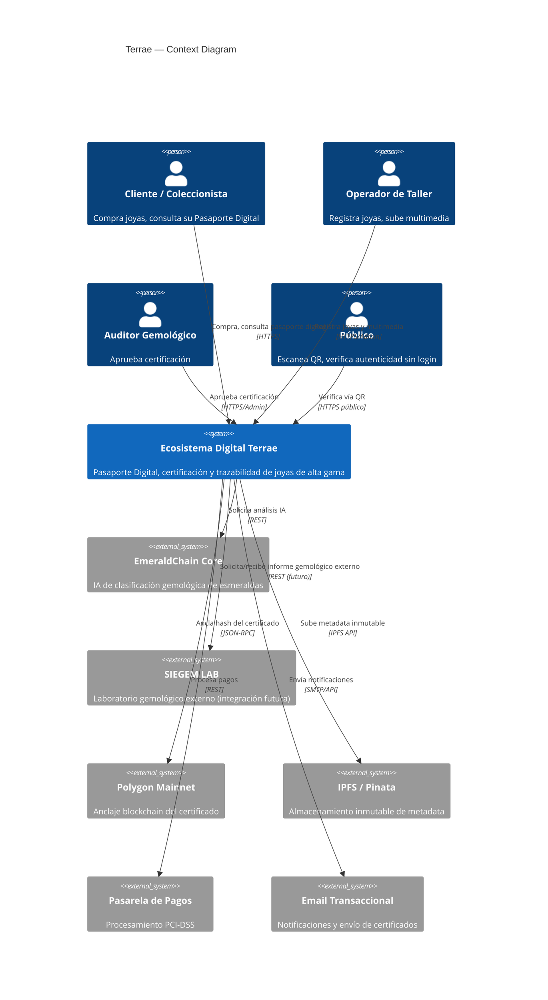

### 3.2 Container Diagram

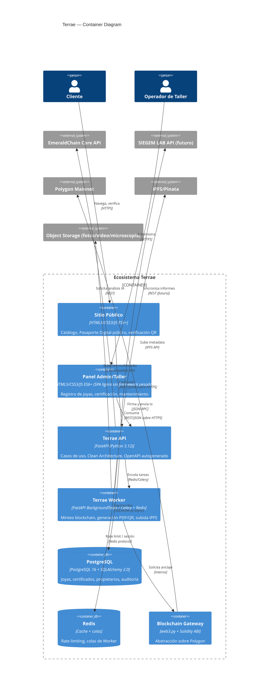

### 3.3 Component Diagram (Terrae API)

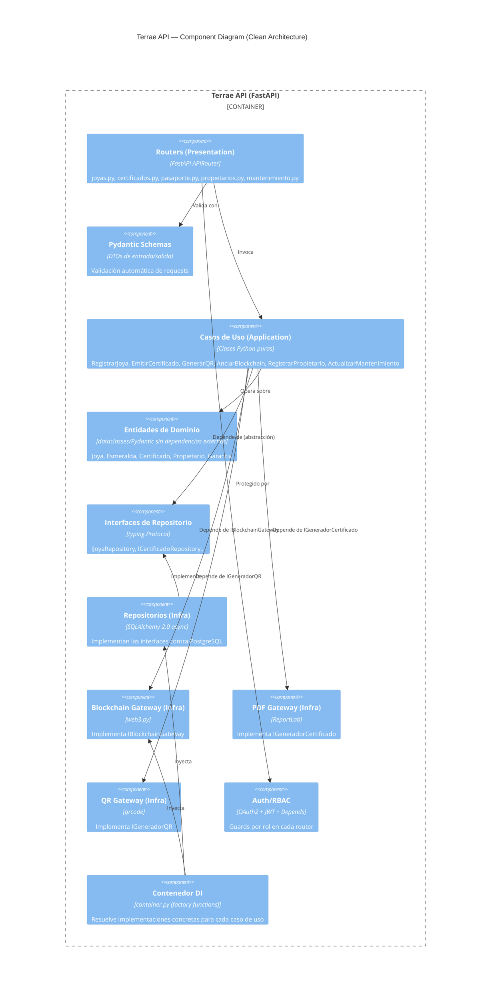

### 3.4 Code Diagram (alto nivel — módulo Certificados)

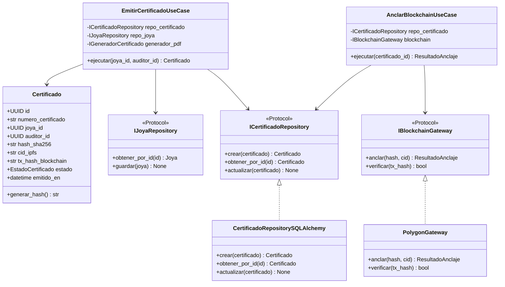

---

## 4. Diagramas de Secuencia

### 4.1 Registro de una Joya

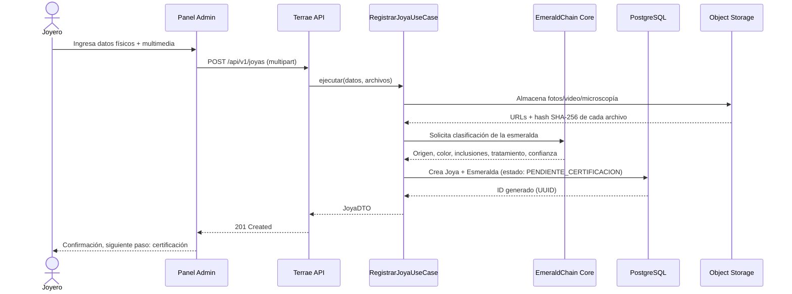

### 4.2 Generación Automática del QR

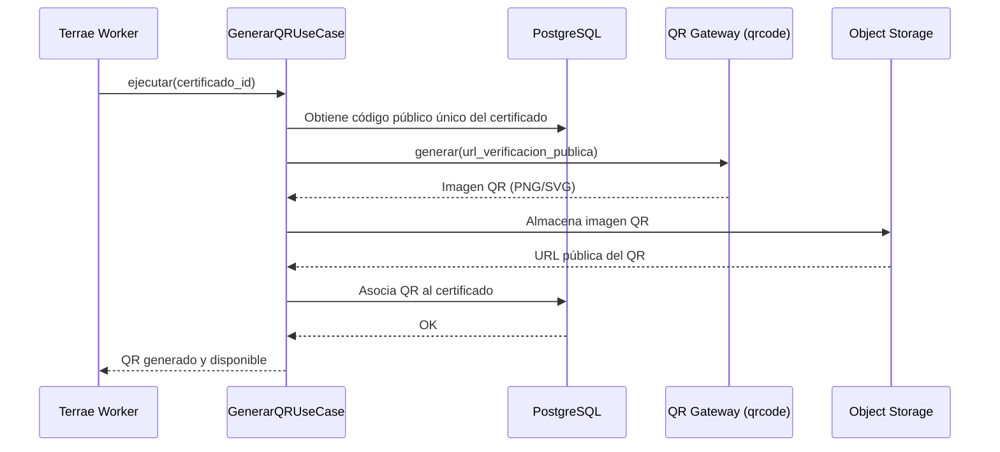

### 4.3 Generación del Certificado PDF

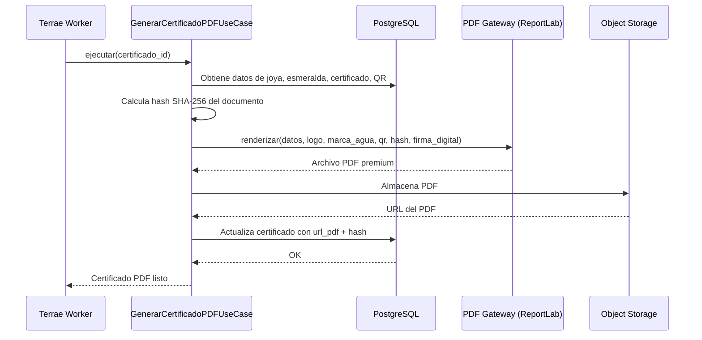

### 4.4 Registro en Blockchain

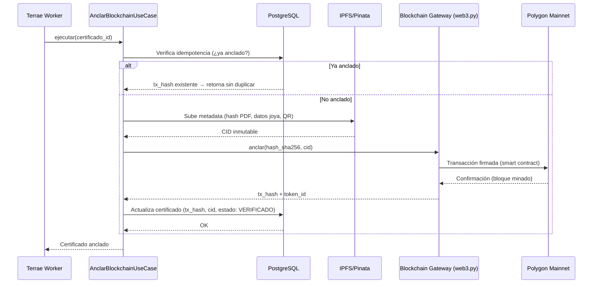

### 4.5 Consulta del Pasaporte Digital

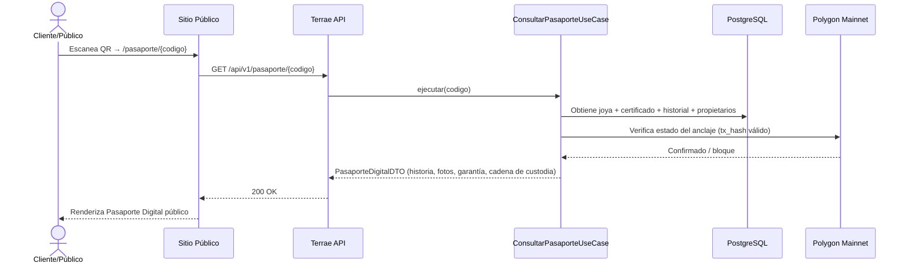

### 4.6 Registro del Propietario

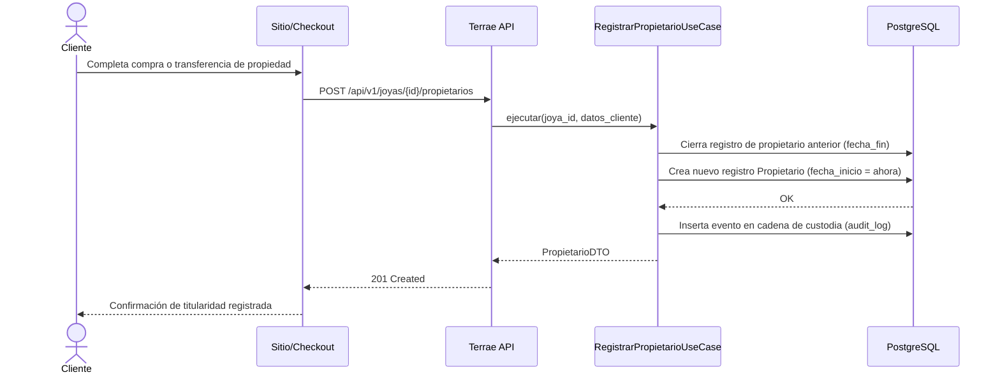

### 4.7 Actualización del Historial de Mantenimiento

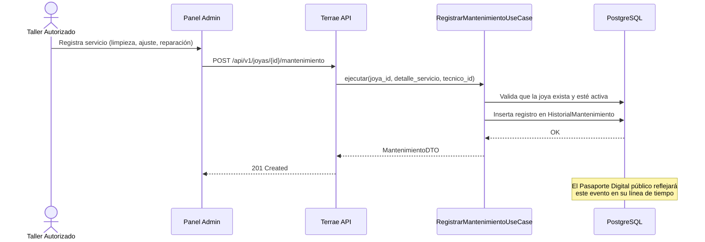

---

## 5. Modelo Entidad-Relación (ERD)

```mermaid
erDiagram
    USUARIO ||--o{ JOYA : registra
    USUARIO ||--o{ CERTIFICADO : audita
    USUARIO ||--o{ LOG : genera
    USUARIO }o--|| ROL : tiene

    ROL {
        uuid id PK
        string nombre "SUPER_ADMIN, ADMIN, AUDITOR, OPERADOR, CLIENTE"
        jsonb permisos
    }

    USUARIO {
        uuid id PK
        string email UK
        string password_hash
        string nombre_completo
        uuid rol_id FK
        string copnia_id "nullable"
        boolean activo
        timestamp creado_en
    }

    COLECCION ||--o{ JOYA : agrupa
    COLECCION {
        uuid id PK
        string nombre
        string temporada
        text descripcion
        timestamp creado_en
    }

    JOYA ||--o| ESMERALDA : engasta
    JOYA ||--o| CERTIFICADO : posee
    JOYA ||--o{ FOTOGRAFIA : tiene
    JOYA ||--o{ VIDEO : tiene
    JOYA ||--o{ MICROSCOPIA : tiene
    JOYA ||--o{ DOCUMENTO : adjunta
    JOYA ||--o{ PROPIETARIO : tuvo
    JOYA ||--o{ HISTORIAL_MANTENIMIENTO : registra
    JOYA ||--o| GARANTIA : cubierta_por
    JOYA {
        uuid id PK
        string sku UK
        string nombre
        string tipo_pieza
        decimal peso_gramos
        string metal
        uuid coleccion_id FK
        uuid esmeralda_id FK
        string estado
        decimal precio
        uuid registrado_por FK
        timestamp creado_en
    }

    ESMERALDA {
        uuid id PK
        string origen_predicho "Muzo, Chivor, Otro"
        decimal confianza_ia
        string color_grado
        string tratamiento
        decimal quilates
        jsonb resultado_analisis_ia
        string informe_siegem_id "nullable, integración futura"
        timestamp analizado_en
    }

    CERTIFICADO ||--o{ QR_CODE : genera
    CERTIFICADO ||--o| BLOCKCHAIN_REGISTRO : ancla
    CERTIFICADO ||--o| NFT : mintea_opcional
    CERTIFICADO {
        uuid id PK
        string numero_certificado UK
        uuid joya_id FK
        uuid auditor_id FK
        string firma_digital
        string hash_sha256
        string url_pdf
        string estado
        timestamp emitido_en
    }

    QR_CODE {
        uuid id PK
        uuid certificado_id FK
        string codigo_publico UK
        string url_imagen
        integer escaneos_totales
        timestamp creado_en
    }

    BLOCKCHAIN_REGISTRO {
        uuid id PK
        uuid certificado_id FK
        string cid_ipfs
        string tx_hash UK
        string red "polygon-mainnet"
        string estado
        timestamp anclado_en
    }

    NFT {
        uuid id PK
        uuid certificado_id FK
        string token_id UK
        string contrato_direccion
        string wallet_propietario
        boolean activo
        timestamp minteado_en
    }

    GARANTIA {
        uuid id PK
        uuid joya_id FK
        date fecha_inicio
        date fecha_fin
        string cobertura
        string estado
    }

    PROPIETARIO {
        uuid id PK
        uuid joya_id FK
        uuid usuario_id FK "nullable si no está registrado"
        string nombre_completo
        date fecha_inicio
        date fecha_fin "nullable si es el actual"
        string tipo_adquisicion "compra, herencia, transferencia"
    }

    HISTORIAL_MANTENIMIENTO {
        uuid id PK
        uuid joya_id FK
        uuid tecnico_id FK
        string tipo_servicio "limpieza, ajuste, reparacion"
        text detalle
        date fecha_servicio
        string taller_autorizado
    }

    FOTOGRAFIA {
        uuid id PK
        uuid joya_id FK
        string url
        string sha256_hash
        string tipo "campo, laboratorio, macro, producto"
        timestamp subida_en
    }

    VIDEO {
        uuid id PK
        uuid joya_id FK
        string url
        string sha256_hash
        integer duracion_segundos
        timestamp subida_en
    }

    MICROSCOPIA {
        uuid id PK
        uuid joya_id FK
        string url_imagen
        string tipo_inclusion
        string equipo_usado
        timestamp capturada_en
    }

    DOCUMENTO {
        uuid id PK
        uuid joya_id FK
        string tipo "factura, seguro, informe_externo"
        string url
        timestamp subido_en
    }

    AUDITORIA {
        uuid id PK
        uuid usuario_id FK
        string entidad_afectada
        uuid entidad_id
        string accion
        jsonb datos_antes
        jsonb datos_despues
        timestamp ocurrido_en
    }

    LOG {
        uuid id PK
        uuid usuario_id FK "nullable"
        string nivel "info, warning, error"
        string mensaje
        jsonb contexto
        timestamp ocurrido_en
    }

    CONFIGURACION {
        uuid id PK
        string clave UK
        jsonb valor
        string descripcion
        timestamp actualizado_en
    }
```

**Notas del modelo:**
- `AUDITORIA` es append-only e inmutable a nivel de aplicación (sin `UPDATE`/`DELETE` permitidos por rol alguno) — es la fuente de verdad legal, independiente del anclaje blockchain.
- `NFT` es una tabla opcional y desacoplada: el sistema funciona completo sin ella; se activa por `CONFIGURACION` (`nft_habilitado: true`) cuando el negocio lo decida.
- `informe_siegem_id` en `ESMERALDA` es un campo de integración futura — hoy nullable, mañana FK a una tabla `INFORME_SIEGEM` cuando se firme la integración.

---

## 6. Estructura del Proyecto (lista para GitHub)

```
terrae/
├── backend/
│   ├── app/
│   │   ├── domain/
│   │   │   ├── entities/          # Joya, Esmeralda, Certificado, Propietario...
│   │   │   ├── repositories/      # Protocol interfaces
│   │   │   └── services/          # ServicioHashing, ServicioValidacion
│   │   ├── application/
│   │   │   ├── use_cases/         # registrar_joya.py, emitir_certificado.py...
│   │   │   └── dtos/
│   │   ├── infrastructure/
│   │   │   ├── database/
│   │   │   │   ├── models/        # SQLAlchemy ORM models
│   │   │   │   └── repositories/  # Implementaciones concretas
│   │   │   ├── blockchain/        # PolygonGateway, contratos ABI
│   │   │   ├── ipfs/              # PinataGateway
│   │   │   ├── pdf/               # ReportLabGenerator
│   │   │   ├── qr/                # QRCodeGenerator
│   │   │   └── siegem/            # SiegemLabGateway (futuro)
│   │   ├── presentation/
│   │   │   ├── routers/           # joyas.py, certificados.py, pasaporte.py...
│   │   │   ├── schemas/           # Pydantic DTOs
│   │   │   ├── dependencies.py    # Auth guards, DI
│   │   │   └── middlewares/
│   │   ├── core/
│   │   │   ├── config.py          # Settings (Pydantic Settings)
│   │   │   ├── container.py       # Contenedor de DI
│   │   │   └── security.py        # JWT, hashing de passwords
│   │   └── main.py
│   ├── alembic/                   # Migraciones
│   ├── tests/
│   │   ├── unit/                  # Tests de domain/ y application/
│   │   └── integration/           # Tests contra DB de prueba
│   ├── Dockerfile
│   ├── requirements.txt
│   └── pyproject.toml
│
├── frontend/
│   ├── publico/                   # Sitio público: catálogo, pasaporte digital, verificación QR
│   │   ├── index.html
│   │   ├── pasaporte.html
│   │   ├── catalogo.html
│   │   ├── assets/
│   │   │   ├── css/                # design-tokens.css, componentes.css
│   │   │   └── js/                 # módulos ES6
│   ├── admin/                     # Panel operador/auditor
│   │   ├── index.html
│   │   ├── joyas/
│   │   ├── certificados/
│   │   └── assets/
│   └── shared/                    # Componentes y tokens compartidos
│
├── blockchain/
│   ├── contracts/
│   │   └── TerraeCertificate.sol
│   ├── scripts/                   # Deploy scripts
│   └── test/                      # Tests del smart contract
│
├── docker/
│   ├── docker-compose.yml
│   ├── docker-compose.dev.yml
│   └── nginx/
│
├── certificados/                  # Plantillas ReportLab (no PDFs generados — esos van a storage)
│   └── plantilla_certificado.py
│
├── qr/
│   └── plantilla_qr.py
│
├── scripts/
│   ├── seed_data.py
│   ├── backup_db.sh
│   └── deploy.sh
│
├── pruebas/                       # (alias de tests/ a nivel de repo, e2e cross-stack)
│   └── e2e/
│
├── docs/
│   ├── arquitectura/              # Este documento y sus diagramas fuente
│   ├── manual_identidad_visual.pdf
│   ├── api/                       # OpenAPI exportado
│   └── runbooks/                  # Procedimientos operativos (incidentes, rollback)
│
├── .github/
│   └── workflows/                 # CI/CD (test, lint, build, deploy a Railway)
│
├── .env.example
├── README.md
└── LICENSE
```

---

## 7. Definición de APIs REST

Documentadas, **no implementadas** en esta fase. Prefijo: `/api/v1`. Formato de error uniforme: RFC 7807.

### 7.1 Joyas

| Endpoint | Método | Parámetros | Respuesta | Errores | Seguridad |
|---|---|---|---|---|---|
| `/joyas` | POST | Body: datos joya + multipart multimedia | 201 `JoyaDTO` | 400 validación, 401, 403 | JWT, rol OPERADOR+ |
| `/joyas` | GET | Query: `estado`, `coleccion_id`, `cursor`, `limit` | 200 lista paginada | 401 | JWT |
| `/joyas/{id}` | GET | Path: `id` | 200 `JoyaDTO` | 404 | JWT |
| `/joyas/{id}` | PATCH | Body: campos a actualizar | 200 `JoyaDTO` | 400, 403, 404 | JWT, rol OPERADOR+ (solo propio) |
| `/joyas/{id}/mantenimiento` | POST | Body: tipo, detalle, fecha | 201 `MantenimientoDTO` | 400, 403, 404 | JWT, rol OPERADOR/taller autorizado |
| `/joyas/{id}/propietarios` | POST | Body: datos del nuevo propietario | 201 `PropietarioDTO` | 400, 403, 404 | JWT |
| `/joyas/{id}/propietarios` | GET | Path: `id` | 200 lista cadena de custodia | 404 | JWT, rol AUDITOR/ADMIN |

### 7.2 Certificados

| Endpoint | Método | Parámetros | Respuesta | Errores | Seguridad |
|---|---|---|---|---|---|
| `/certificados/{joya_id}/solicitar` | POST | Path: `joya_id` | 202 `CertificadoDTO` (EN_PROCESO) | 400, 404 | JWT, rol OPERADOR+ |
| `/certificados/{joya_id}/aprobar` | POST | Header: `Idempotency-Key` | 200 `CertificadoDTO` | 403, 404, 409 | JWT, rol AUDITOR |
| `/certificados/{id}` | GET | Path: `id` | 200 `CertificadoDTO` | 404 | JWT o público si `codigo_publico` |
| `/certificados/{id}/pdf` | GET | Path: `id` | 200 `application/pdf` | 404 | JWT o público con `codigo_publico` |
| `/certificados/{id}/revocar` | POST | Body: motivo | 200 `CertificadoDTO` | 403, 404 | JWT, rol ADMIN |

### 7.3 Pasaporte Digital y verificación pública

| Endpoint | Método | Parámetros | Respuesta | Errores | Seguridad |
|---|---|---|---|---|---|
| `/pasaporte/{codigo}` | GET | Path: `codigo` público del QR | 200 `PasaporteDigitalDTO` | 404 | Público, sin auth, rate limit 20/min |
| `/pasaporte/{codigo}/verificar-blockchain` | GET | Path: `codigo` | 200 estado on-chain | 404, 503 (RPC caído) | Público, rate limit |

### 7.4 Blockchain (uso interno del Worker)

| Endpoint | Método | Parámetros | Respuesta | Errores | Seguridad |
|---|---|---|---|---|---|
| `/blockchain/certificados/{id}/estado` | GET | Path: `id` | 200 estado de anclaje | 404 | JWT, rol ADMIN |
| `/blockchain/certificados/{id}/reintentar` | POST | Header: `Idempotency-Key` | 202 | 403, 409 | JWT, rol ADMIN |

### 7.5 Administración

| Endpoint | Método | Parámetros | Respuesta | Errores | Seguridad |
|---|---|---|---|---|---|
| `/usuarios` | GET/POST | — | 200/201 | 401, 403 | JWT, rol ADMIN |
| `/usuarios/{id}/rol` | PATCH | Body: `rol_id` | 200 | 403, 404 | JWT, rol SUPER_ADMIN |
| `/auditoria` | GET | Query: filtros | 200 lista | 403 | JWT, rol ADMIN (solo lectura) |
| `/configuracion` | GET/PATCH | — | 200 | 403 | JWT, rol SUPER_ADMIN |

---

## 8. Seguridad

| Control | Diseño |
|---|---|
| **JWT** | Access token 15 min, refresh token 7 días con rotación (invalida el anterior al usarse); firmado con RS256, clave privada fuera del repositorio (variable de entorno / Railway secrets) |
| **Roles y permisos** | RBAC con 6 roles (ver sección 9 de Fase 0); permisos como `jsonb` en tabla `ROL` para granularidad futura sin migración |
| **Rate limiting** | Redis + `slowapi`: 100 req/min autenticado, 20 req/min público (endpoint de verificación QR es el más expuesto a scraping/abuso) |
| **CORS** | Whitelist explícita de dominios `terrae.com`, `admin.terrae.com`; sin wildcard `*` en producción |
| **Validación** | Pydantic v2 en cada request; validación de tipo de archivo y tamaño máximo en cargas multimedia (evita subida de ejecutables disfrazados) |
| **Sanitización** | Sanitización de HTML en campos de texto libre (descripciones, detalle de mantenimiento) antes de persistir, para prevenir XSS almacenado en el Pasaporte Digital público |
| **Auditoría** | Tabla `AUDITORIA` append-only registrando actor, entidad, acción, estado antes/después en cada mutación crítica (certificado, propietario, rol) |
| **Logs** | Structured logging (JSON) centralizado; sin PII sensible en logs de nivel `info` (solo en `AUDITORIA`, con controles de acceso) |
| **Protección contra ataques comunes** | SQL Injection: mitigado por ORM parametrizado (SQLAlchemy); CSRF: tokens en formularios del panel admin; Brute force login: bloqueo progresivo tras intentos fallidos; Secrets: gestión vía variables de entorno de Railway, nunca en código o `.env` versionado |
| **Cifrado** | TLS 1.3 en tránsito (Railway/CDN); cifrado en reposo de PII (emails, nombres de propietarios) a nivel de columna con `pgcrypto` |
| **Firma digital del certificado** | Firma criptográfica del PDF (clave privada de Terrae) verificable independientemente del anclaje blockchain — dos capas de confianza |

---

## 9. Flujo Completo del QR


El código público del QR **no es el UUID interno** de la joya (evita enumeración de inventario) — es un código aleatorio de 128 bits generado exclusivamente para la URL de verificación, sin relación matemática visible con el ID de base de datos.

---

## 10. Flujo Blockchain (diseño, sin implementar)

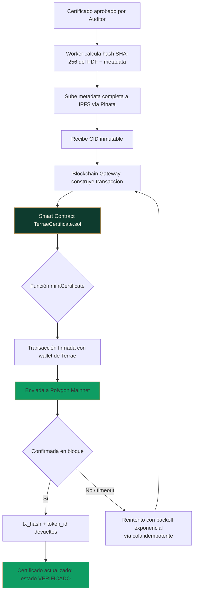

**Consideraciones de diseño del smart contract (a especificar en Fase 2, no implementar aún):**
- Patrón `AccessControl` de OpenZeppelin: solo la wallet operacional de Terrae (multisig recomendado) puede llamar `mintCertificate`.
- Función `revokeCertificate` que no borra el registro (inmutabilidad) sino que marca un flag `revocado = true` — la transparencia exige que la revocación también quede en cadena.
- Eventos (`CertificateMinted`, `CertificateRevoked`) indexables para reconstruir el estado sin depender únicamente de PostgreSQL.

---

## 11. Flujo de Generación del Certificado PDF

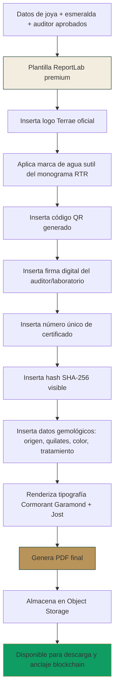

**Especificación de diseño del certificado:**
- Formato A4 vertical, márgenes generosos (25mm) — el espacio en blanco comunica exclusividad, nunca "llenar la página".
- Logo Terrae centrado en el encabezado, en Verde Terrae sobre fondo Marfil (o inverso en variante "edición oscura" para piezas de colección especial).
- Marca de agua: el monograma RTR al 4% de opacidad, repetido diagonalmente, imperceptible salvo a contraluz — medida antifalsificación discreta.
- Bloque de datos gemológicos en `JetBrains Mono` (hash, número de certificado, coordenadas de origen) — contraste tipográfico deliberado frente al resto en Cormorant Garamond/Jost, señalando "esto es un dato verificable, no prosa de marca".
- QR ubicado en esquina inferior derecha con borde en Oro Satinado, tamaño mínimo 3×3cm para escaneo confiable en impresión.

---

## 12. Diseño UX/UI — Guía de Estilos

Basado exclusivamente en el logotipo, la paleta (Verde Terrae, Oro Satinado, Nogal, Marfil, Esmeralda) y las tipografías (Cormorant Garamond, Jost, JetBrains Mono) definidas en la Fase 0. No se introduce ningún color ni fuente adicional.

### 12.1 Sistema de espaciado

Escala basada en múltiplos de 8px (ritmo consistente, evita ajustes arbitrarios):

```
--space-1: 8px;   --space-2: 16px;  --space-3: 24px;
--space-4: 32px;  --space-5: 48px;  --space-6: 64px;
--space-7: 96px;  --space-8: 128px;
```

El espaciado en Terrae es generoso por principio: ningún componente usa `--space-1` como padding exterior de una tarjeta de producto; el mínimo para "aire" alrededor de contenido de marca es `--space-3` (24px).

### 12.2 Jerarquía tipográfica

| Nivel | Fuente | Tamaño / Peso | Uso |
|---|---|---|---|
| Display XL | Cormorant Garamond | 64px / 300 | Hero de home, nombre de colección |
| Display L | Cormorant Garamond | 40px / 500 | Título de producto/pieza |
| Título | Cormorant Garamond | 28px / 500 | Encabezados de sección |
| Cuerpo | Jost | 16px / 400 | Texto de producto, descripciones |
| Cuerpo secundario | Jost | 14px / 300 | Metadatos, leyendas |
| UI/Botones | Jost | 14px / 500, letter-spacing 0.08em, mayúsculas | Botones, navegación |
| Dato técnico | JetBrains Mono | 13px / 400 | Hash, tx_hash, número de certificado, timestamps |

### 12.3 Componentes

**Botones**
- Primario: fondo Verde Terrae, texto Marfil, borde 1px Oro Satinado; sin `border-radius` agresivo (4px máximo — nunca "pill button").
- Secundario: fondo transparente, borde 1px Oro Satinado, texto Verde Terrae/Marfil según fondo.
- Hover: transición de 400ms, el borde dorado se intensifica (`--terrae-oro-300`); nunca escalado (`scale`) ni sombra dura.
- Estado deshabilitado: opacidad 40%, cursor `not-allowed`, sin cambio de color.

**Tarjetas (piezas de catálogo)**
- Fondo Marfil sobre Nogal, borde 1px sutil en Oro Satinado al 20% de opacidad.
- Imagen de producto ocupa 80% del área, fotografía editorial (nunca fondo blanco tipo e-commerce genérico).
- Precio en Jost 500, nombre de la pieza en Cormorant Garamond itálica.

**Timeline (historial de mantenimiento y propietarios)**
- Línea vertical delgada en Oro Satinado; cada hito con un punto sólido en Esmeralda si es un evento de certificación/blockchain, en Oro Satinado si es mantenimiento.
- Fecha en JetBrains Mono pequeño, descripción en Jost.

**Certificados (vista web del Pasaporte Digital)**
- Replica la jerarquía visual del PDF: bloque de datos gemológicos siempre en JetBrains Mono, separado visualmente del storytelling de la pieza.
- Badge de verificación blockchain: ícono discreto (sello, no un logo de criptomoneda genérico) en Esmeralda con texto "Verificado en blockchain" en Jost 12px.

**Formularios (panel admin/taller)**
- Inputs con borde inferior 1px (estilo "editorial", no cajas con `border-radius` y sombra tipo Material).
- Labels en Jost 12px mayúsculas con letter-spacing, sobre el campo.
- Foco: el borde inferior cambia a Esmeralda, sin glow ni sombra azulada.

**Tablas (inventario, auditoría)**
- Encabezados en Jost 500 mayúsculas sobre fondo Nogal, texto Marfil.
- Filas con separador 1px al 10% de opacidad, sin "zebra striping" saturado — alternancia sutil de 2% de luminosidad.

**Animaciones**
- Duración estándar: 400–600ms, easing `cubic-bezier(0.4, 0, 0.2, 1)`.
- Transiciones de página: fundido (`opacity`), nunca deslizamientos bruscos tipo app móvil.
- El QR y el sello de verificación blockchain pueden tener un brillo sutil de "revelado" al cargar (metáfora de "lo que la tierra esconde, Terrae lo revela") — un único uso deliberado de animación con significado narrativo, no decorativo repetido.

---

## 13. Roadmap

| Fase | Duración estimada | Alcance |
|---|---|---|
| **Fase 0** | Completada | Identidad visual, paleta, tipografía, arquitectura preliminar |
| **Fase 1** | Completada (este documento) | Arquitectura enterprise completa: C4, secuencia, ERD, APIs, seguridad, UX/UI, flujos |
| **Fase 2 — Fundaciones de código** | 4–6 semanas | Setup del monorepo, modelos SQLAlchemy + Alembic, smart contract `TerraeCertificate.sol` con tests, design system CSS (tokens + componentes base) |
| **Fase 3 — MVP funcional** | 8–10 semanas | Módulos Joyas y Certificados end-to-end (registro → certificación → QR → PDF → anclaje testnet), Pasaporte Digital público, panel admin básico |
| **Fase 4 — Producción mainnet** | 3–4 semanas | Migración a Polygon mainnet, auditoría de seguridad del smart contract, hardening de API, CI/CD completo en Railway |
| **Fase 5 — Escalamiento** | 3 meses | Historial de mantenimiento y propietarios completo, garantías, reportes admin, multi-idioma ES/EN |
| **Fase 6 — Integraciones avanzadas** | Paralelo/continuo | Integración SIEGEM LAB, NFT opcional activable, expansión del modelo `ESMERALDA` a rubíes/zafiros/diamantes (alineado al roadmap de EmeraldChain) |

---

## 14. Riesgos Técnicos y Mitigación

| Riesgo | Probabilidad | Impacto | Mitigación |
|---|---|---|---|
| Volatilidad del gas en Polygon o congestión de red | Media | Medio | Cola de anclaje con reintentos y backoff exponencial; anclaje en lote (batch) fuera de horas pico si el volumen crece |
| Pérdida de la clave privada de la wallet operacional | Baja | Crítico | Wallet multisig (Gnosis Safe) desde el día 1 en mainnet, nunca clave única en variable de entorno de un solo servidor |
| Dependencia de Pinata/IPFS (proveedor único) | Media | Medio | Interfaz `IIPFSGateway` abstracta; pin redundante en un segundo proveedor (Filebase/Web3.Storage) como respaldo |
| Falsificación física de una pieza con QR clonado | Baja | Alto | El código QR por sí solo no certifica nada — la página de verificación siempre re-consulta el estado on-chain en tiempo real, no cachea "verificado" de forma permanente |
| Crecimiento de la base de datos sin índices adecuados a escala de cientos de miles de joyas | Media | Medio | Índices desde el diseño inicial en `sku`, `codigo_publico`, `tx_hash`; particionamiento de `AUDITORIA` y `LOG` por fecha si el volumen lo exige |
| Cambio de proveedor de IA (EmeraldChain Core evoluciona su API) | Media | Bajo | El resultado de IA se persiste como `jsonb` versionado (`resultado_analisis_ia`), desacoplado del esquema fijo — cambios de la API externa no rompen el histórico |
| Integración SIEGEM LAB no confirmada aún | Alta (es un riesgo de dependencia externa, no técnico) | Bajo (hoy) | Campo `informe_siegem_id` nullable, gateway `SiegemLabGateway` ya definido como interfaz — el sistema funciona completo sin la integración; se activa sin migración disruptiva cuando esté lista |
| Vendor lock-in con Railway | Baja | Medio | Contenerización completa con Docker desde el día 1 — migrar a AWS/GCP/Fly.io no requiere reescribir la aplicación, solo la capa de despliegue |

---

## 15. Auditoría Final de la Arquitectura

| Criterio | Estado | Justificación |
|---|---|---|
| Escalable | ✅ | Modular monolith con límites de bounded context claros; migración a microservicios posible sin reescritura si el volumen lo exige en Fase 6+ |
| Modular | ✅ | Clean Architecture con 4 capas; cada módulo de negocio (Joyas, Certificados, Propietarios, Mantenimiento) desacoplado |
| Segura | ✅ | JWT + RBAC + rate limiting + auditoría inmutable + cifrado en tránsito y reposo diseñados desde la Fase 1 |
| Documentada | ✅ | Este documento + OpenAPI autogenerado por FastAPI + diagramas versionables en `docs/arquitectura` |
| Lista para producción | ⚠️ Pendiente de Fase 2–4 | La arquitectura está lista; falta la implementación, tests y auditoría de seguridad del smart contract antes de mainnet |
| Compatible con GitHub Pages | ✅ | El frontend público (HTML5/CSS3/JS estático) puede servirse desde GitHub Pages para páginas de bajo tráfico o como CDN de respaldo del catálogo |
| Compatible con Railway | ✅ | Backend FastAPI + PostgreSQL + Redis ya validados en el stack de EmeraldChain sobre Railway |
| Compatible con Docker | ✅ | Todo el stack contenerizado, `docker-compose` para desarrollo local paritario a producción |
| Compatible con PostgreSQL | ✅ | Modelo de datos relacional completo con JSONB para flexibilidad donde se requiere |
| Compatible con Polygon | ✅ | Blockchain Gateway abstracto sobre web3.py, smart contract EVM estándar |
| Compatible con IPFS | ✅ | Gateway abstracto sobre Pinata con ruta de redundancia a segundo proveedor |
| Compatible con SIEGEM LAB | ⚠️ Preparado, no confirmado | Interfaz y campos de datos ya modelados; activación sin migración disruptiva cuando se confirme la integración |
| Preparada para IA y funcionalidades futuras | ✅ | Resultado de IA versionado en JSONB; NFT y multi-gema (rubí/zafiro/diamante) ya contemplados en el modelo sin romper el esquema actual |

**Veredicto del equipo:** la arquitectura queda aprobada como especificación oficial para iniciar la Fase 2 (fundaciones de código). No se requiere redefinición de arquitectura en fases posteriores salvo decisión estratégica explícita del CTO/CEO.

---

## Siguiente paso

Esta Fase 1 no contiene código. Los entregables naturales de **Fase 2** son, en este orden de dependencia:

1. `TerraeCertificate.sol` (smart contract) con suite de tests.
2. Modelos SQLAlchemy + migraciones Alembic para el ERD completo de la sección 5.
3. Design system (`frontend/shared/`) con los tokens de espaciado/tipografía/color de la sección 12 en CSS puro.
4. Módulo `Joyas` completo (domain → application → infrastructure → presentation) como primer caso de uso vertical de referencia para el resto del equipo.

¿Con cuál arrancamos?
